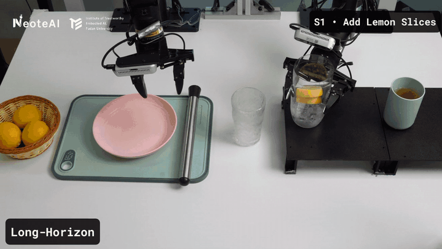

<h1 align="center">N<sub>0</sub>-TWAM: A Tactile-Native World Action Model</h1>

<p align="center">
  <a href="https://research.neoteai.com/n0-twam/"></a>
  <a href="https://research.neoteai.com/assets/n0-twam-paper.pdf"></a>
  <a href="LICENSE"></a>
</p>

<p align="center"><strong>Pretrained checkpoint · inference server · post-training toolkit · UniVTAC Track 3.1 pipeline</strong></p>

$N_0$-TWAM is a Vision–Tactile–Action world-action model. It jointly models
vision, tactile observations, and actions with a Mixture-of-Transformers (MoT)
under one rectified-flow / flow-matching objective. The model predicts visual
and tactile futures while generating the low-level action that realizes them.

This README is the reproducible, source-checkout path from a raw UniVTAC release
to a verified Track 3.1 training checkpoint. For other workflows:

| Goal | Start here |
|---|---|
| Train UniVTAC Track 3.1 end to end | [End-to-end UniVTAC training](#end-to-end-univtac-track-31-training) |
| Adapt the released model to your own robot demonstrations | [Post-training guide](docs/POST_TRAINING.md) |
| Serve a checkpoint or connect a robot/simulator | [Deployment guide](docs/DEPLOY.md) |
| Use the concise public CLI reference | [Track 3.1 quickstart](docs/TRACK31_QUICKSTART.md) |
| Inspect the immutable data and advanced multi-node contracts | [Detailed Track 3.1 protocol](docs/TRACK31_UNIVTAC.md) |

<p align="center">
  
</p>

<p align="center">
  <a href="https://research.neoteai.com/n0-twam/">
    
  </a>
  <br><em>Real-robot demo highlights — click for the full video.</em>
</p>

## What is included

- The released 7.16B $N_0$-TWAM checkpoint and model loader.
- Data conversion and content-addressed latent preprocessing for UniVTAC.
- Native 8D `qpos8_next_step` Track 3.1 training; ACT is not imported by this
  training path and is only an algorithmic reference.
- A strict public command, `n0-twam track31`, for training, resume, checkpoint
  verification, and the unified Target-10 tactile-quality evaluation.
- A websocket inference server and a numpy-only closed-loop client.

### Reproducibility boundary

The repository validates request schemas, data identities, latent inventories,
training lineage, and checkpoint sidecars. A successful public training command
produces a `status=complete` receipt and a complete checkpoint. It does **not**
automatically establish organizer acceptance, a hidden-server leaderboard score,
NVIDIA simulator task success, or real-robot success.

The public launcher records `execution_tier=local_package`,
`formal_track31=false`, and `leaderboard_eligible=false`. The advanced
multi-node HCU operator path has a separate site-specific provenance contract.

## Requirements

### Software

- Linux is recommended for preprocessing and training.
- Python **3.10, 3.11, or 3.12**. Python 3.9 and 3.13 are not supported.
- Git and a compiler/toolchain suitable for the selected PyTorch runtime.
- `uv` is recommended; standard `venv` + `pip` also works.

### Hardware

- A BF16-capable accelerator exposed to PyTorch through `torch.cuda`.
  NVIDIA CUDA and supported vendor HCU runtimes use the same logical `cuda:N`
  interface in this codebase.
- Enough device memory for a 7.16B model and the selected world size. The exact
  requirement depends on the runtime and sharding implementation; a one-device
  dry run does not prove that a one-device training step will fit.
- Enough local/shared storage for raw HDF5, two LeRobot repositories, video and
  tactile latents, the base model, and checkpoints.

CPU-only training and formal Track 3.1 latent encoding are not supported. The
portable launcher is single-node and can use one or more local devices. The
advanced multi-node HCU examples are documented separately and should be
adapted to the operator's own SSH, container, and collective environment.

## Install from source

Full data preparation requires a source checkout because the repository-level
`script/` utilities are intentionally not installed into the Python wheel.

```bash
git clone https://github.com/neoteai/N0-TWAM.git
cd N0-TWAM

uv venv --python 3.12
source .venv/bin/activate
uv pip install --editable '.[track31]'

# LeRobot 0.3.3 declares an old torch<2.8 dependency. Keep this project's
# validated Torch runtime and install only the LeRobot package itself.
uv pip install --no-deps 'lerobot==0.3.3'
uv pip install 'huggingface-hub[cli]'
```

Without `uv`, replace the environment/install section with:

```bash
python3.12 -m venv .venv
source .venv/bin/activate
python -m pip install --upgrade pip
python -m pip install --editable '.[track31]'
python -m pip install --no-deps 'lerobot==0.3.3'
python -m pip install 'huggingface-hub[cli]'
```

Validate the active interpreter and CLI before downloading large assets:

```bash
python --version
python -c 'import torch; print("torch", torch.__version__, "cuda", torch.cuda.is_available(), "devices", torch.cuda.device_count())'
n0-twam --version
n0-twam track31 --help
```

`flash-attn` is optional. It is needed only when explicitly selecting
`attn_mode=flashattn`; Track 3.1 training does not require it. See
[INSTALL.md](docs/INSTALL.md) for details.

> HCU users should begin with a vendor-compatible PyTorch image. Do not replace
> the vendor runtime blindly with a generic CUDA wheel; install this repository
> around that runtime according to the vendor's compatibility matrix.

## Download the base model

The released bundle is hosted at
[NeoteAI/n0-twam-base](https://huggingface.co/NeoteAI/n0-twam-base). It must
contain the following entries:

```text
n0-twam-base/
├── transformer/
│   ├── config.json
│   └── diffusion_pytorch_model.safetensors
├── vae/
├── text_encoder/
├── tokenizer/
├── norm_stat_pretrain.json
└── empty_emb.pt
```

Released post-training checkpoints are also available:

| Model | Contents | Link |
|---|---|---|
| UniVTAC 8 tasks · absEE | `transformer/` + `train_meta.json` | [NeoteAI/n0-twam-univtac-absee](https://huggingface.co/NeoteAI/n0-twam-univtac-absee) |
| UniVTAC 8 tasks · delta EE | `transformer/` + `train_meta.json` | [NeoteAI/n0-twam-univtac-delta](https://huggingface.co/NeoteAI/n0-twam-univtac-delta) |
| NeoSim 12 tasks · absEE | `transformer/` + `train_meta.json` | [NeoteAI/n0-twam-neosim-absee](https://huggingface.co/NeoteAI/n0-twam-neosim-absee) |
| NeoSim 12 tasks · delta EE | `transformer/` + `train_meta.json` | [NeoteAI/n0-twam-neosim-delta](https://huggingface.co/NeoteAI/n0-twam-neosim-delta) |

These are multi-task checkpoints produced from `n0-twam-base` with the
[post-training recipe](docs/POST_TRAINING.md). Each task has its own
normalization statistics; use the `multitask_server` config to select the task
and bind its statistics, keys, and prompt. See the
[deployment guide](docs/DEPLOY.md#serving-a-multi-task-checkpoint).

Choose a work directory outside the Git checkout, then download the model:

```bash
export N0_REPO="$PWD"
export N0_WORK=/absolute/path/to/n0-twam-work
export N0_BASE="$N0_WORK/models/n0-twam-base"

mkdir -p "$N0_WORK/models" "$N0_WORK/cache" "$N0_WORK/requests" "$N0_WORK/runs"
hf download NeoteAI/n0-twam-base --local-dir "$N0_BASE"

test -f "$N0_BASE/transformer/config.json"
test -f "$N0_BASE/transformer/diffusion_pytorch_model.safetensors"
test -f "$N0_BASE/empty_emb.pt"
test ! -L "$N0_BASE/empty_emb.pt"
```

The strict Track 3.1 path requires `empty_emb.pt` to be a real, regular file,
not a symbolic link. If an existing Hugging Face cache exposes symlinks, copy
the complete snapshot into a dedicated model directory before training.

## End-to-end UniVTAC Track 3.1 training

### 1. Obtain the required external assets

This repository does not redistribute UniVTAC or the organizer's split files.
Before preprocessing, obtain:

1. the raw UniVTAC HDF5 release;
2. the official/released 40-episode validation declaration;
3. the one-episode quarantine declaration described below.

Set absolute paths:

```bash
export N0_RAW=/absolute/path/to/UniVTAC
export N0_SPLITS=/absolute/path/to/univtac-splits
export N0_ARTIFACTS="$N0_WORK/artifacts"
export N0_LEROBOT="$N0_WORK/lerobot"
```

The raw tree must contain all eight tasks:

```text
UniVTAC/
├── grasp_classify/clean/*.hdf5
├── insert_HDMI/clean/*.hdf5
├── insert_hole/clean/*.hdf5
├── insert_tube/clean/*.hdf5
├── lift_bottle/clean/*.hdf5
├── lift_can/clean/*.hdf5
├── pull_out_key/clean/*.hdf5
└── put_bottle_in_shelf/clean/*.hdf5
```

Each HDF5 episode must provide:

- `embodiment/joint`
- `step`
- `observation/head/rgb`
- `observation/wrist/rgb`
- `tactile/left_gsmini/rgb_marker`
- `tactile/right_gsmini/rgb_marker`

Raw episode files must be regular files below `N0_RAW`; the strict source audit
rejects symlinks and paths that escape the dataset root.

Split declarations are JSON lists. Every entry has a raw-root-relative path and
an optional task that must agree with the path:

```json
[
  {
    "hdf5_path": "insert_HDMI/clean/0.hdf5",
    "task": "insert_HDMI"
  }
]
```

For the standard protocol, the validation declaration must select exactly five
episodes per task (40 total). The canonical local Target-10 projection uses
source episode IDs `0,1,2,3,5` for both `insert_HDMI` and `lift_bottle`. Do not
invent a different split when comparing checkpoints. The quarantine declaration
must contain only:

```json
[
  {
    "hdf5_path": "grasp_classify/clean/90.hdf5",
    "task": "grasp_classify"
  }
]
```

The standard source universe is:

| Physical cohort | Episodes | Per-task contract |
|---|---:|---|
| `train759` | 759 | 94 `grasp_classify`; 95 for each other task |
| `frozen40` | 40 | 5 per task |
| `quarantine1` | 1 | `grasp_classify/clean/90.hdf5` only |

### 2. Audit, freeze, and materialize UniVTAC

Run the source auditor and converter once. `N0_ARTIFACTS` and `N0_LEROBOT`
should be new destinations; do not point them at the raw dataset.

```bash
cd "$N0_REPO"
python script/track3_1/prepare_univtac.py \
  --data-root "$N0_RAW" \
  --validation-manifest "$N0_SPLITS/validation.json" \
  --quarantine-manifest "$N0_SPLITS/quarantine.json" \
  --artifact-dir "$N0_ARTIFACTS" \
  --materialize-root "$N0_LEROBOT" \
  --repo-id univtac_track31 \
  --emit-standard-views
```

This command audits the eight-task source, freezes HDF5 SHA-256 values,
constructs the leakage-free views, computes q01/q99 action normalization from
training rows only, and writes LeRobot v2.1 repositories named `train759` and
`frozen40`.

Successful preparation includes all of these files/directories:

```bash
test -f "$N0_ARTIFACTS/universe_manifest_v4.json"
test -f "$N0_ARTIFACTS/conversion_report.json"
test -f "$N0_ARTIFACTS/views/stage_a_dev719_v1.json"
test -f "$N0_ARTIFACTS/views/stage_a_final759_v1.json"
test -f "$N0_ARTIFACTS/views/frozen_target10_v1.json"
test -f "$N0_ARTIFACTS/normalizers/qpos8_dev719_v1.json"
test -f "$N0_ARTIFACTS/normalizers/qpos8_final759_v1.json"
test -d "$N0_LEROBOT/train759"
test -d "$N0_LEROBOT/frozen40"
```

If the immutable artifact bundle already exists but conversion was interrupted,
use the recovery-aware materializer instead of rerunning the source audit:

```bash
python script/track3_1/materialize_univtac.py \
  --artifact-dir "$N0_ARTIFACTS" \
  --target-root "$N0_LEROBOT" \
  --repo-id univtac_track31
```

Its target must not already exist unless it is a recognized recoverable
transaction. Never delete or hand-edit the published manifest, views,
normalizers, conversion report, or completion markers.

### 3. Encode the training latents

Track 3.1 training reads precomputed video and tactile latents. During recipe
development and training, encode **only** `train759`; keep `frozen40` sealed
until a checkpoint has been selected for evaluation.

First cache the immutable encoder-source identity:

```bash
python script/track3_1/cache_encoder_source_identity.py \
  --model-path "$N0_BASE" \
  --output-path "$N0_WORK/cache/encoder_source_identity.json"
```

The output is created once and must not already exist. Next expose exactly one
accelerator as logical `cuda:0` and precompute the eight unique umT5 prompts:

```bash
export CUDA_VISIBLE_DEVICES=0
export HIP_VISIBLE_DEVICES=0

python script/track3_1/precompute_hcu_prompt_cache.py \
  --dataset-root "$N0_LEROBOT/train759" \
  --model-path "$N0_BASE" \
  --artifact-root "$N0_ARTIFACTS" \
  --split train759 \
  --encoder-source-identity-path "$N0_WORK/cache/encoder_source_identity.json" \
  --output-path "$N0_WORK/cache/train759_prompt_embeddings.pt" \
  --device cuda:0
```

Despite the script's historical `hcu` name, the runtime contract is one
PyTorch accelerator exposed as `cuda:0`; it does not fall back to CPU.

Encode RGB/video latents:

```bash
python script/encode_lerobot_n0_latents.py \
  --dataset-root "$N0_LEROBOT/train759" \
  --model-path "$N0_BASE" \
  --artifact-root "$N0_ARTIFACTS" \
  --split train759 \
  --prompt-embedding-cache-path "$N0_WORK/cache/train759_prompt_embeddings.pt" \
  --encoder-source-identity-path "$N0_WORK/cache/encoder_source_identity.json" \
  --device cuda:0 \
  --text-encoder-device cuda:0 \
  --dtype bf16 \
  --target-fps 10 \
  --height 256 \
  --width 256 \
  --max-sequence-length 512
```

Encode both tactile streams:

```bash
python script/encode_tactile_latent.py \
  --dataset-root "$N0_LEROBOT/train759" \
  --model-path "$N0_BASE" \
  --artifact-root "$N0_ARTIFACTS" \
  --split train759 \
  --tactile-keys observation.images.tactile_a observation.images.tactile_b \
  --mode both \
  --local-mode current \
  --device cuda:0 \
  --encoder-source-identity-path "$N0_WORK/cache/encoder_source_identity.json" \
  --dtype bf16 \
  --target-fps 10 \
  --height 128 \
  --width 128
```

Finally rebuild and cross-check the content-addressed inventories:

```bash
python script/track3_1/finalize_track31_latents.py \
  --dataset-root "$N0_LEROBOT/train759" \
  --model-path "$N0_BASE" \
  --artifact-root "$N0_ARTIFACTS" \
  --split train759 \
  --kind both \
  --validate-pair

test -f "$N0_LEROBOT/train759/latent_video_inventory.json"
test -f "$N0_LEROBOT/train759/latent_tactile_inventory.json"
```

For parallel preprocessing, use deterministic `--num-shards`,
`--shard-index`, and `--defer-inventory` workers, then run exactly one finalizer.
The complete sharded examples are in
[TRACK31_UNIVTAC.md](docs/TRACK31_UNIVTAC.md).

### 4. Create the strict training request

Generate the complete request; do not start from an old environment-variable
launcher:

```bash
n0-twam track31 template train \
  --output "$N0_WORK/requests/stage-a-development.json"
```

Compute the two file identities used by a fresh Stage A run:

```bash
sha256sum "$N0_BASE/empty_emb.pt"
sha256sum "$N0_BASE/transformer/diffusion_pytorch_model.safetensors"
```

Edit `stage-a-development.json`. Absolute paths are recommended. Relative paths
are resolved relative to the JSON file, not the current shell directory.

| Request field | Value for Stage A development |
|---|---|
| `runtime.devices` | Physical local device IDs, e.g. `[0,1,2,3,4,5,6,7]` |
| `paths.artifact_root` | `$N0_ARTIFACTS` |
| `paths.lerobot_root` | `$N0_LEROBOT` (the launcher selects `train759`) |
| `paths.base_model` | `$N0_BASE` |
| `paths.empty_embedding` | `$N0_BASE/empty_emb.pt` |
| `paths.empty_embedding_sha256` | First `sha256sum` result |
| `paths.released_checkpoint` | `$N0_BASE` |
| `paths.released_transformer_sha256` | Second `sha256sum` result |
| `paths.output_root` | A new directory such as `$N0_WORK/runs/stage-a-development` |
| `paths.resume_from` / `init_from` | `null` for a fresh Stage A run |
| `train.profile` | `multitask_pretrain_v1` |
| `train.run_role` | `development` |
| `train.batch_size` / `gradient_accumulation_steps` | `1` / `1` |

The default recipe is 1500 optimizer steps, saves every 300 steps, validates
every 100 steps, and uses a global batch of
`len(runtime.devices) × batch_size × gradient_accumulation_steps`.

Validate the JSON syntax and resolve the launch plan:

```bash
python -m json.tool "$N0_WORK/requests/stage-a-development.json" >/dev/null
n0-twam track31 train \
  --config "$N0_WORK/requests/stage-a-development.json" \
  --dry-run
```

`--dry-run` validates the request route and prints the resolved command. It does
not load the model, inspect every dataset byte, initialize collectives, or prove
that the selected devices have enough memory. The real command performs the
full filesystem/data/checkpoint preflight before the first training step.

### 5. Start training with one command

```bash
n0-twam track31 train \
  --config "$N0_WORK/requests/stage-a-development.json" \
  > "$N0_WORK/runs/stage-a-development.command-result.json"
```

The command is synchronous. It:

1. verifies immutable data, normalizer, latent, model, and initialization
   identities;
2. records the active source package and dependency versions without copying
   ambient secrets;
3. launches one local `torchrun` with one worker per selected device;
4. trains to `stop_after_step`;
5. verifies the final checkpoint and writes a completion receipt.

Follow the live log in a second shell:

```bash
tail -F "$N0_WORK/runs/stage-a-development/logs"/train.*.log
```

Inspect accelerator utilization with the tool provided by the runtime, for
example `nvidia-smi dmon` on NVIDIA or `hy-smi` on the HCU environment.

A successful run has all of the following:

```bash
test -f "$N0_WORK/runs/stage-a-development/checkpoints/checkpoint_step_1500/checkpoint_complete.json"
test -f "$N0_WORK/runs/stage-a-development/checkpoints/checkpoint_step_1500/training_state.json"
test -f "$N0_WORK/runs/stage-a-development/checkpoints/checkpoint_step_1500/train_meta.json"
python -m json.tool "$N0_WORK/runs/stage-a-development.command-result.json"
```

The command result and `training_receipts/` entry must report
`"status": "complete"`. A directory named `checkpoint_step_*` is not sufficient
unless its strict completion sidecars also pass verification.

### 6. Resume safely

Resume is full-state and strict: model, optimizer, scheduler, RNG, data cursor,
world size, code identity, dependency identity, data identity, and scientific
recipe must remain compatible.

Create a **new** JSON request and a **new** `output_root`; never reuse or write
inside the parent checkpoint tree. Keep the same profile, run role, world size,
batch settings, `num_steps`, save interval, validation interval, and latent
horizon. Set:

```json
{
  "paths": {
    "released_checkpoint": null,
    "released_transformer_sha256": null,
    "resume_from": "/absolute/path/to/parent/checkpoint_step_300",
    "init_from": null,
    "output_root": "/absolute/path/to/new/resume-run"
  },
  "train": {
    "num_steps": 1500,
    "stop_after_step": 1500
  }
}
```

The fragment above shows only changed fields; the actual request must retain all
fields generated by the template. Then run the same command:

```bash
n0-twam track31 train --config /absolute/path/to/resume.json
```

A fresh run may go directly to 1500 steps. A `20 → 25 → 1500` sequence is only
an optional hardware/collective bring-up strategy; it is not required by the
algorithm. When using such a ladder, set `num_steps=1500` from the first run and
change only `stop_after_step`, `resume_from`, `run_id`, and the new output root.

### 7. Development, final refit, and optional Stage B

The standard views are selected by `profile` and `run_role`:

| Route | Training view | Internal validation | Initialization |
|---|---:|---:|---|
| Stage A `development` | 719 episodes | 40 training-only internal-dev episodes | Released 20D prior |
| Stage A `final_refit` | all 759 episodes | none | Fresh from released 20D prior |
| Stage B `development` | 180 target-task episodes | 10 training-only target-dev episodes | Matching Stage A development checkpoint |
| Stage B `final_refit` | all 190 target-task episodes | none | Matching Stage A final-refit checkpoint |

Recommended scientific workflow:

1. Use Stage A development for code validation and recipe selection.
2. Lock the recipe.
3. Start an independent Stage A `final_refit` from the released prior with a new
   output root; do not resume the 719-episode development trajectory into the
   759-episode route.
4. Optionally run Stage B with `profile=target_finetune_v1`, the same run role,
   `init_from=<complete Stage A checkpoint>`, `resume_from=null`, and a new
   output root. Stage B resets optimizer/scheduler/RNG as a weights-only branch.
5. Select/freeze the evaluation checkpoint before opening `frozen40`.

No raw or converted frozen evaluation episode may be used for training,
normalization, hyperparameter selection, or checkpoint selection.

## Unified Target-10 tactile-quality evaluation

After locking a checkpoint, encode `frozen40` in a dedicated evaluation job; do
not mount it during training. Reuse the immutable
`encoder_source_identity.json`, create a separate
`frozen40_prompt_embeddings.pt`, run both latent encoders with
`--dataset-root "$N0_LEROBOT/frozen40" --split frozen40`, and finish with the
same `finalize_track31_latents.py --kind both --validate-pair` gate. Never reuse
the `train759` prompt-cache path for this evaluation job.

Generate the strict evaluation request:

```bash
n0-twam track31 template eval \
  --output "$N0_WORK/requests/target10.eval.json"
```

The request must bind the selected complete checkpoint, base model and VAE,
empty embedding, converted `frozen40`, training normalizer, raw UniVTAC root,
`frozen_target10_v1`, the approved metric implementation, and the published
golden calibration assets. Those reference/organizer assets are external and
are not silently synthesized by this repository.

```bash
n0-twam track31 eval --request "$N0_WORK/requests/target10.eval.json"
```

The local default is the fixed 10-episode projection: five `Insert HDMI` and
five `Lift Bottle` episodes. It builds a causal continuous 41-frame trajectory,
selects rows `0,5,...,40`, materializes tactile predictions, recomputes
PSNR/SSIM from the MP4 inventory, and signs the result only after every identity
check passes. This repository protocol must not be described as the organizer's
hidden test set unless the organizer independently confirms that equivalence.
See [TRACK31_QUICKSTART.md](docs/TRACK31_QUICKSTART.md) and the detailed
[Tactile Prediction Quality protocol](docs/TRACK31_UNIVTAC.md#4-tactile-prediction-quality).

NVIDIA simulator task-success evaluation is a separate final phase; PSNR/SSIM
alone does not establish closed-loop manipulation success.

## Post-train on your own demonstrations

For non-UniVTAC robots, convert demonstrations to LeRobot v2.1, precompute video
and tactile latents, build action normalization statistics, edit the post-train
config, and launch:

```bash
NGPU=8 bash run_posttrain.sh
```

The own-data action schema and serving configuration differ from the Track 3.1
`qpos8_next_step` contract. Follow [POST_TRAINING.md](docs/POST_TRAINING.md) from
the beginning instead of mixing the two pipelines.

## Load the released model

```python
import torch

from n0_twam.models.utils import load_mot_checkpoint

model = load_mot_checkpoint(
    "/absolute/path/to/n0-twam-base/transformer",
    torch_dtype=torch.bfloat16,
    torch_device="cuda",
)
print(f"{sum(parameter.numel() for parameter in model.parameters()) / 1e9:.2f} B")
```

## Evaluate in NeoSim (closed loop)

[NeoSim](https://github.com/neoteai/NeoSim) runs in a separate environment and
talks to the N0-TWAM websocket server. Start the server:

```bash
python -m n0_twam.n0_twam_server --config-name posttrain_server --port 29601
```

Then run the corresponding NeoSim evaluation client. The held-out example uses
20 episodes with seeds 100–119:

```bash
python eval/eval_twam_ee_cl.py <task> demo \
  --server_host <server-ip> \
  --server_port 29601 \
  --prompt "<training prompt, verbatim>" \
  --start_seed 100 \
  --total_num 20
```

See [DEPLOY.md](docs/DEPLOY.md) for bundle creation, key alignment, tactile
representation, and the generic
[`closed_loop_client.py`](example_client/closed_loop_client.py).

## Troubleshooting

| Symptom | Cause and action |
|---|---|
| `unsupported operand type(s) for |` while importing | The interpreter is Python 3.9 or older. Activate the Python 3.10–3.12 environment. |
| `ModuleNotFoundError: lerobot` | Install `lerobot==0.3.3 --no-deps` inside the same environment as `n0-twam`. |
| `torch.cuda.is_available() == False` | The active PyTorch build cannot see the accelerator. Fix the driver/container/runtime before preprocessing. CPU fallback is intentionally disabled. |
| Prompt/latent encoder requires exactly one visible HCU as `cuda:0` | Set `CUDA_VISIBLE_DEVICES`/`HIP_VISIBLE_DEVICES` to one physical device and keep `--device cuda:0`. The message also applies to a CUDA device under this formal contract. |
| `paths.empty_embedding_sha256` or transformer SHA mismatch | Recompute the exact file hash. Do not bypass or copy a hash from another bundle. |
| `output_root must be disjoint` | Use a new output directory that is neither an input nor an ancestor/descendant of the model, artifacts, dataset, or checkpoint. |
| Missing/partial latent inventory | Finish all shards, then run `finalize_track31_latents.py --kind both --validate-pair`. |
| Strict resume rejects code/environment/world size | Restore the exact recorded environment and recipe, or start a new weights-only experiment. Do not relabel it as a strict resume. |
| Out of memory | Use more local devices/a compatible sharding runtime. Batch size is already 1 in the public template; changing horizon or architecture creates a different experiment. |
| Training command exits without a receipt | Read `OUTPUT_ROOT/logs/preflight.*.log` first, then `train.*.log`. A failed preflight intentionally prevents training. |

## Repository structure

```text
N0-TWAM/
├── n0_twam/
│   ├── models/                 # MoT backbone and model loading
│   ├── configs/                # base, post-train, and Track 3.1 configs
│   ├── dataset/                # LeRobot latent datasets and samplers
│   ├── data/                   # latent identities and inventories
│   ├── integrations/univtac/   # raw-data audit, views, conversion, normalizers
│   ├── checkpointing/          # strict save/resume and lineage contracts
│   ├── evaluation/             # Target-10 generation and metric pipeline
│   ├── track31/                # public request, runner, preflight, provenance
│   ├── train.py                # training entry point
│   └── cli.py                  # `n0-twam track31`
├── script/
│   ├── encode_lerobot_n0_latents.py
│   ├── encode_tactile_latent.py
│   └── track3_1/               # UniVTAC preparation/evaluation utilities
├── tests/                      # unit, integration, and regression contracts
├── docs/                       # installation, training, deployment, Track 3.1
├── run_track31.sh              # source-tree wrapper for the public CLI
├── run_posttrain.sh            # own-data post-training launcher
└── pyproject.toml
```

## Development and verification

Install development dependencies and LeRobot:

```bash
uv pip install --editable '.[dev,track31]'
uv pip install --no-deps 'lerobot==0.3.3'
```

Run the local contract suite and static checks:

```bash
pytest -q tests/unit tests/integration tests/regression
black --check n0_twam script tests
flake8 n0_twam script tests
```

Synthetic/local tests do not replace a real accelerator smoke. Before claiming
a new platform as supported, run: data preflight, one forward/backward update,
checkpoint save, strict reload/resume, validation, Target-10 evaluation, and the
relevant simulator/robot closed loop.

## Model summary

| Component | Choice |
|---|---|
| Backbone | WAN2.2 TI2V-5B video diffusion transformer, restructured into a 3-expert MoT |
| Video VAE | Wan2.2 `AutoencoderKLWan` (`z_dim=48`, 4× temporal / 16× spatial) |
| Text encoder | umT5-xxl (4096-d), frozen |
| Objective | Rectified-flow / flow-matching with per-frame timesteps |
| Precision | BF16 parameters and runtime-dependent distributed reductions |
| Released action space | 20D dual-arm end-effector action |
| UniVTAC Track 3.1 action space | 8D `qpos8_next_step` |

### Highlights

- **Three modality experts (MoT).** Separate video, tactile, and action experts
  are coupled through shared cross-attention.
- **One flow-matching objective.** Video, tactile, and action streams are
  temporally aligned and co-generated.
- **Tactile as target and condition.** A global tactile stream predicts the
  future, while an optional local stream conditions the action expert on the
  current tactile observation.

## Citation

```bibtex
@misc{n0twam2026,
  title={$N_0$-TWAM: Scaling Tactile-Native World-Action Model for Contact-Rich Manipulation},
  author={NeoteAI Team and Fudan TEAI Team},
  year={2026},
  eprint={2607.23783},
  archivePrefix={arXiv},
  url={https://arxiv.org/abs/2607.23783}
}
```

## Acknowledgments

- [LingBot-VA](https://github.com/robbyant/lingbot-va) — causal world-modeling framework
- [Wan2.2](https://github.com/Wan-Video/Wan2.2) — video diffusion backbone and VAE
- [FastWAM](https://github.com/yuantianyuan01/FastWAM) — shared-attention MoT design reference
- [LeRobot](https://github.com/huggingface/lerobot) — dataset format and tooling

## License

Released under [CC-BY-NC-SA-4.0](LICENSE). This license permits reuse under its
attribution, non-commercial, and share-alike terms; it is not an OSI-approved
software license. Review the license before commercial use. Redistributed
third-party components retain their own licenses and notices.
