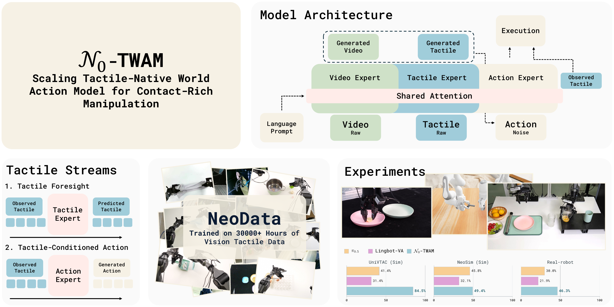

<h1 align="center">N<sub>0</sub>-TWAM: A Tactile-Native World Action Model</h1>

<p align="center">
  <a href="https://research.neoteai.com/n0-twam/"></a>
  <a href="https://arxiv.org/abs/2607.23783"></a>
  <a href="LICENSE"></a>
</p>

<p align="center"><strong>Pretrained checkpoint · inference server · UniVTAC Track 3.1 · Franka Track 3.2 post-training</strong></p>

$N_0$-TWAM is a Vision–Tactile–Action world-action model. It jointly models
vision, tactile observations, and actions with a Mixture-of-Transformers (MoT)
under one rectified-flow / flow-matching objective. The model predicts visual
and tactile futures while generating the low-level action that realizes them.

This branch adds a reproducible, vision-only Franka Track 3.2 path while
retaining the existing UniVTAC Track 3.1 workflow. For each workflow:

| Goal | Start here |
|---|---|
| Post-train on official Franka data for Track 3.2 | [Track 3.2 Franka training tutorial](#track-32-franka-training-tutorial) |
| Inspect the full Franka data, training, and Policy contract | [Detailed Franka protocol](docs/TRACK32_FRANKA.md) |
| Train UniVTAC Track 3.1 end to end | [Track 3.1 UniVTAC training tutorial](#track-31-univtac-training-tutorial) |
| Adapt the released model to your own robot demonstrations | [Post-training guide](docs/POST_TRAINING.md) |
| Package and serve a checkpoint | [Deployment guide](docs/DEPLOY.md) |
| Use the concise public CLI reference | [Track 3.1 quickstart](docs/TRACK31_QUICKSTART.md) |
| Inspect the immutable data and advanced multi-node contracts | [Detailed Track 3.1 protocol](docs/TRACK31_UNIVTAC.md) |

<p align="center">
  
</p>

## What is included

- A model loader and documented integration for the externally hosted 7.16B
  $N_0$-TWAM checkpoint.
- Data conversion and content-addressed latent preprocessing for UniVTAC.
- Native 8D `qpos8_next_step` Track 3.1 training; ACT is not imported by this
  training path and is only an algorithmic reference.
- A strict public command, `n0-twam track31`, for training, resume, checkpoint
  verification, and the unified Target-10 tactile-quality evaluation.
- A websocket inference server and a numpy-only client scaffold. Their presence
  is an integration aid, not evidence of simulator or robot task success.
- A Franka Track 3.2 profile that keeps the released 20D Action Expert, maps
  official 8D end-pose actions into EE10 channels `0..9`, masks channels
  `10..19`, and trains without tactile observations.
- A WorldArena Policy-compatible Franka adapter returning one finite `float32`
  `(1, 8)` `end_pose_base` command per long-poll call, while re-grounding N0 on
  time-aligned post-action RGB.

### Reproducibility boundary

The repository validates request schemas, data identities, latent inventories,
training lineage, and checkpoint sidecars. A successful public training command
produces a `status=complete` receipt and a complete checkpoint. It does **not**
automatically establish organizer acceptance, a hidden-server leaderboard score,
external simulator task success, or real-robot success.

The public launcher records its local execution tier and keeps organizer
evaluation status false until a real evaluation is performed. Multi-node HCU
examples are site-specific operator references, not a portable hardware-support
guarantee.

## Requirements

### Software

- Linux is recommended for preprocessing and training.
- Python **3.10, 3.11, or 3.12**. Python 3.9 and 3.13 are not supported.
- Git and a compiler/toolchain suitable for the selected PyTorch runtime.
- `uv` is recommended; standard `venv` + `pip` also works.

### Hardware

- A BF16-capable accelerator exposed to PyTorch through `torch.cuda`. NVIDIA
  CUDA is the portable path. The HCU path requires a vendor PyTorch runtime that
  intentionally exposes the same logical `cuda:N` API; a generic CUDA wheel is
  not an HCU runtime.
- Enough device memory for a 7.16B model and the selected world size. The exact
  requirement depends on the runtime and sharding implementation; a one-device
  dry run does not prove that a one-device training step will fit.
- Enough local/shared storage for raw HDF5, LeRobot repositories, the latents
  required by the selected workflow, the base model, and checkpoints. Measure
  the selected dataset revision locally instead of relying on a fixed estimate.

CPU-only training and formal Track 3.1 latent encoding are not supported. The
portable launcher is single-node and can use one or more local devices. The
advanced multi-node HCU examples are documented separately and must be adapted
to the operator's own SSH, container, collective, and network environment.

## Install from source

Full data preparation requires a source checkout because the repository-level
`script/` utilities are intentionally not installed into the Python wheel.

```bash
git clone --branch Franka-PostTraining --single-branch \
  https://github.com/destinyls/N0-TWAM.git
cd N0-TWAM

uv venv --python 3.12
source .venv/bin/activate
uv pip install --editable '.[track31,track32]'

# LeRobot 0.3.3 declares an old torch<2.8 dependency. Keep this project's
# validated Torch runtime and install only the LeRobot package itself.
uv pip install --no-deps 'lerobot==0.3.3'
uv pip install 'huggingface-hub[cli]'
```

Without `uv`, replace the environment/install section with:

```bash
python3.12 -m venv .venv
source .venv/bin/activate
python -m pip install --upgrade pip
python -m pip install --editable '.[track31,track32]'
python -m pip install --no-deps 'lerobot==0.3.3'
python -m pip install 'huggingface-hub[cli]'
```

Validate the active interpreter and CLI before downloading large assets:

```bash
python --version
python -c 'import torch; print("torch", torch.__version__, "cuda", torch.cuda.is_available(), "devices", torch.cuda.device_count())'
n0-twam --version
n0-twam track31 --help
n0-twam track32 --help
```

`flash-attn` is optional. It is needed only when explicitly selecting
`attn_mode=flashattn`; Track 3.1 training does not require it. See
[INSTALL.md](docs/INSTALL.md) for details.

> HCU users should begin with a vendor-compatible PyTorch image. Do not replace
> the vendor runtime blindly with a generic CUDA wheel; install this repository
> around that runtime according to the vendor's compatibility matrix.

## Download the base model

The released bundle is hosted at
[NeoteAI/n0-twam-base](https://huggingface.co/NeoteAI/n0-twam-base). It must
contain the following entries:

```text
n0-twam-base/
├── transformer/
│   ├── config.json
│   └── diffusion_pytorch_model.safetensors
├── vae/
├── text_encoder/
├── tokenizer/
├── norm_stat_pretrain.json
└── empty_emb.pt
```

Released post-training checkpoints are also available:

| Model | Contents | Link |
|---|---|---|
| UniVTAC 8 tasks · absEE | `transformer/` + `train_meta.json` | [NeoteAI/n0-twam-univtac-absee](https://huggingface.co/NeoteAI/n0-twam-univtac-absee) |
| UniVTAC 8 tasks · delta EE | `transformer/` + `train_meta.json` | [NeoteAI/n0-twam-univtac-delta](https://huggingface.co/NeoteAI/n0-twam-univtac-delta) |
| NeoSim 12 tasks · absEE | `transformer/` + `train_meta.json` | [NeoteAI/n0-twam-neosim-absee](https://huggingface.co/NeoteAI/n0-twam-neosim-absee) |
| NeoSim 12 tasks · delta EE | `transformer/` + `train_meta.json` | [NeoteAI/n0-twam-neosim-delta](https://huggingface.co/NeoteAI/n0-twam-neosim-delta) |

These are multi-task checkpoints produced from `n0-twam-base` with the
[post-training recipe](docs/POST_TRAINING.md). Each task has its own
normalization statistics; use the `multitask_server` config to select the task
and bind its statistics, keys, and prompt. See the
[deployment guide](docs/DEPLOY.md#serving-a-multi-task-checkpoint).

These upstream post-training checkpoints retain their own action, dataset, and
normalizer contracts. They are not strict-resume checkpoints for the Track 3.1
`qpos8_next_step` route or the Track 3.2 Franka `ee20_absee` route described
below. Start those routes from the initialization named in their own request.

Choose a work directory outside the Git checkout, then download the model:

```bash
export N0_REPO="$PWD"
export N0_WORK=/absolute/path/to/n0-twam-work
export N0_BASE="$N0_WORK/models/n0-twam-base"

mkdir -p "$N0_WORK/models" "$N0_WORK/cache" "$N0_WORK/requests" "$N0_WORK/runs"
hf download NeoteAI/n0-twam-base --local-dir "$N0_BASE"

test -f "$N0_BASE/transformer/config.json"
test -f "$N0_BASE/transformer/diffusion_pytorch_model.safetensors"
test -f "$N0_BASE/empty_emb.pt"
test ! -L "$N0_BASE/empty_emb.pt"
```

The strict Track 3.1 path requires `empty_emb.pt` to be a real, regular file,
not a symbolic link. If an existing Hugging Face cache exposes symlinks, copy
the complete snapshot into a dedicated model directory before training.

## Choose a training route

The same source tree supports both competition routes, but they are separate
training jobs with different datasets and action semantics:

| Route | Training data | Observation profile | Action target | Public entry point |
|---|---|---|---|---|
| Track 3.1 UniVTAC | eight-task UniVTAC HDF5 converted to LeRobot | two RGB + two tactile streams, `vision_tactile` | native `qpos8_next_step` | `n0-twam track31 train --config ...` |
| Track 3.2 Franka | official 600-episode Franka release converted to LeRobot | two RGB streams, `vision_only` | `end_pose_base` 8D -> EE10 -> channels `0..9` of the released EE20 head | `n0-twam track32 train --config ...` |

Both routes reuse the released visual/world-model prior and the common strict
checkpoint machinery. They do **not** share an optimizer checkpoint or a
single action projection: Track 3.1 intentionally trains an 8D qpos action
projection, whereas Track 3.2 preserves the released 20D absolute-EE Action
Expert. Start each route from the initialization specified by its own request.

The `mixed` tactile profile described below supports tactile and RGB-only
repositories in one run only when those repositories already share one action
schema and compatible sample shapes. It does not make `qpos8_next_step` and
Franka `ee20_absee` jointly trainable in one invocation.

The common workflow is:

1. install the repository and download the released base model;
2. audit and convert the route-specific raw dataset;
3. precompute immutable video/tactile latents as required by that route;
4. create a new hash-complete JSON request and run `--dry-run`;
5. execute the synchronous `train` command and verify the strict checkpoint;
6. evaluate the frozen checkpoint using the route-specific offline evaluator;
7. only then proceed to simulator or organizer-controlled real-robot testing.

Use the complete tutorials below rather than mixing commands between routes:

- [Track 3.1 UniVTAC training tutorial](#track-31-univtac-training-tutorial)
- [Track 3.2 Franka training tutorial](#track-32-franka-training-tutorial)

## Tactile training profiles

Every new training config must select one explicit `tactile_profile`:

| profile | dataset contract | tactile parameters |
|---|---|---|
| `vision_tactile` | every selected repo has declared tactile streams; missing latents fail | trainable |
| `mixed` | `per_repo_tactile_keys` exactly lists every repo, using non-empty keys for tactile repos and `[]` for RGB-only repos | trainable; RGB-only batches use `tactile_cond_drop` |
| `vision_only` | all repos have no tactile stream; no synthetic tactile is injected | frozen and excluded from AdamW |

`tactile_optional=True` is not a profile: formal training rejects it because a
missing file must never silently change a tactile repo into an RGB-only repo.
For a mixed pool, declare the roster explicitly:

```python
cfg.tactile_profile = "mixed"
cfg.tactile_mode = "enabled"
cfg.tactile_optional = False
cfg.tactile_keys = ["observation.images.tactile_a"]
cfg.per_repo_tactile_keys = {
    "repo_with_touch": ["observation.images.tactile_a"],
    "repo_rgb_only": [],
}
cfg.freeze_tactile_parameters = False
cfg.tactile_diffusion_loss_weight = 1.0
```

The public launch commands are:

```bash
# Every repository has tactile data (edit twam_posttrain_cfg.py first).
CONFIG_NAME=posttrain NGPU=8 bash run_posttrain.sh

# Explicit tactile/RGB-only repository mixture (edit twam_mixed_cfg.py first).
CONFIG_NAME=mixed_posttrain NGPU=8 bash run_posttrain.sh

# Franka vision-only request created by `n0-twam track32 build-request`.
./run_track32_franka.sh /absolute/path/to/franka-request.json
```

The ready-to-edit mixed template is
`n0_twam/configs/twam_mixed_cfg.py`. The Franka request pins the
`vision_only` profile and is validated before accelerator allocation.

The resolved profile and its self-hashed repo mapping are stored in the
transformer config and all strict-checkpoint sidecars. Strict optimizer resume
rejects profile changes; switching profile is a new weights-only run.

## Track 3.2 Franka training tutorial

This path follows the current WorldArena Franka contract documented in the
[Track 3 description](https://github.com/WorldArena2/WorldArena-2.0/blob/main/assets/track3_description.md): the command is the
base-frame 8D end pose
`[x, y, z, qw, qx, qy, qz, gripper]`. It is **not** the 8D
`[seven joints, gripper]` observation. The adapter converts quaternion `wxyz`
to the N0-TWAM EE10 representation `xyz + rot6d + gripper`, writes it into
channels `0..9` of the released 20D head, and masks channels `10..19`.

The current Franka tasks are vision-only. This profile sends no synthetic
tactile stream, disables LocalTactile/contact gating and tactile loss, and
freezes every tactile-only parameter before AdamW is constructed. The released
20D Action Expert therefore remains checkpoint-compatible.

### 1. Prepare the official data and latents

Choose a new work root outside the source checkout. The command below freezes
the exact official dataset revision, verifies all 3,602 records, downloads the
600 episodes, converts both RGB streams and EE labels, creates leakage-free
development/final views, and encodes 1,200 video-latent payloads over eight
local devices:

```bash
export N0_FRANKA_WORK=/absolute/path/to/franka-track32-work

./prepare_track32_franka_data.sh \
  "$N0_FRANKA_WORK" \
  "$N0_BASE" \
  8
```

The downloader is resumable. A completed preparation contains:

```text
$N0_FRANKA_WORK/
├── provenance/official_franka_inventory.json
├── provenance/download_receipt.json
├── data/official/{clear_up,pour,wipe}/
├── data/lerobot/all600/
└── artifacts/
    ├── prepare_receipt.json
    ├── conversion_report.json
    ├── franka_video_latent_inventory.json
    ├── normalizers/
    └── views/
```

The deterministic development split uses episodes `0..179` of each task for
training (540 total) and `180..199` for internal validation (60 total). This is
a repository development split, **not** the organizer's hidden real-robot test
set. After locking the recipe, `final_refit` uses all 600 public episodes and no
internal validation.

### 2. Build a hash-complete training request

`build-request` audits the prepared data, every latent, the normalizer, the
base model, and `empty_emb.pt`, then writes an immutable request. Select
`portable` for NVIDIA/standard PyTorch. Select `hcu_performance` only in the
validated vendor image that provides grouped Flash Attention. HCU launches
must additionally pass `--collective-network-interface <interface>`; this is a
runtime-specific value such as `bond1`, never a repository-wide hardcode.

```bash
mkdir -p "$N0_FRANKA_WORK/requests" "$N0_FRANKA_WORK/runs"

n0-twam track32 build-request \
  --output "$N0_FRANKA_WORK/requests/franka-development.json" \
  --run-id franka-development-v1 \
  --devices 0,1,2,3,4,5,6,7 \
  --accelerator-profile portable \
  --artifact-root "$N0_FRANKA_WORK/artifacts" \
  --lerobot-root "$N0_FRANKA_WORK/data/lerobot" \
  --base-model "$N0_BASE" \
  --empty-embedding "$N0_BASE/empty_emb.pt" \
  --init-from "$N0_BASE" \
  --output-root "$N0_FRANKA_WORK/runs/franka-development-v1" \
  --run-role development \
  --num-steps 1500 \
  --stop-after-step 1500 \
  --save-interval 300 \
  --val-interval 100 \
  --batch-size 1 \
  --gradient-accumulation-steps 1
```

Inspect the resolved command without allocating accelerators:

```bash
n0-twam track32 train \
  --config "$N0_FRANKA_WORK/requests/franka-development.json" \
  --dry-run
```

### 3. Train with one command

```bash
./run_track32_franka.sh \
  "$N0_FRANKA_WORK/requests/franka-development.json" \
  | tee "$N0_FRANKA_WORK/franka-development.result.json"
```

The command performs fail-closed preflight, records source/environment
provenance, starts one local `torchrun`, verifies the final strict checkpoint,
and emits a `status=complete` training receipt. Follow progress with:

```bash
tail -F "$N0_FRANKA_WORK/runs/franka-development-v1/logs"/train.*.log
```

To create the final model, build a new request with `--run-role final_refit`, a
new `run-id` and output root, and initialize again from the released base model.
Do not resume the 540-episode development trajectory into the 600-episode
final-refit route. Exact logical epochs depend on world size because the sampler
pads only to the global batch boundary; the log and checkpoint receipt record
that coverage.

### 4. Evaluate the checkpoint and export the Franka Policy

Seal a complete checkpoint into a serve bundle using the checkpoint identity
from the training receipt and the matching development/final normalizer:

```bash
n0-twam track32 serve-bundle \
  --checkpoint /absolute/path/to/checkpoint_step_1500 \
  --checkpoint-identity-sha256 CHECKPOINT_IDENTITY_FROM_RECEIPT \
  --base-model "$N0_BASE" \
  --normalizer "$N0_FRANKA_WORK/artifacts/normalizers/franka_dev_train540_v1.json" \
  --normalizer-sha256 NORMALIZER_SEMANTIC_SHA_FROM_REQUEST \
  --output "$N0_FRANKA_WORK/serve-bundle"

n0-twam track32 policy-template \
  --output "$N0_FRANKA_WORK/policy.json"
```

For a development checkpoint, run the real Direct backend over the frozen
60-episode validation view. All output paths must be new. Replace the uppercase
identity placeholders with values from the training and serve-bundle receipts:

```bash
mkdir -p "$N0_FRANKA_WORK/eval"

export N0_FRANKA_CHECKPOINT=/absolute/path/to/checkpoint_step_1500
export N0_FRANKA_CHECKPOINT_ID=CHECKPOINT_IDENTITY_FROM_RECEIPT
export N0_FRANKA_BUNDLE="$N0_FRANKA_WORK/serve-bundle"
export N0_FRANKA_BUNDLE_RECEIPT_SHA=SERVE_BUNDLE_RECEIPT_FILE_SHA256
export N0_FRANKA_NORMALIZER="$N0_FRANKA_WORK/artifacts/normalizers/franka_dev_train540_v1.json"
export N0_FRANKA_VALIDATION_VIEW="$N0_FRANKA_WORK/artifacts/views/franka_dev_validation60_v1.json"

n0-twam track32 generate-predictions \
  --checkpoint "$N0_FRANKA_CHECKPOINT" \
  --checkpoint-identity-sha256 "$N0_FRANKA_CHECKPOINT_ID" \
  --serve-bundle "$N0_FRANKA_BUNDLE" \
  --serve-bundle-receipt-sha256 "$N0_FRANKA_BUNDLE_RECEIPT_SHA" \
  --serve-output "$N0_FRANKA_WORK/eval/direct-backend-output" \
  --artifact-root "$N0_FRANKA_WORK/artifacts" \
  --lerobot-root "$N0_FRANKA_WORK/data/lerobot" \
  --base-model "$N0_BASE" \
  --normalizer "$N0_FRANKA_NORMALIZER" \
  --dataset-view "$N0_FRANKA_VALIDATION_VIEW" \
  --output "$N0_FRANKA_WORK/eval/franka-future-predictions.npz" \
  --device 0 \
  > "$N0_FRANKA_WORK/eval/generation-result.json"
```

The generation result records the exact dataset-view and VAE decoder hashes.
Use those returned values without editing the sealed prediction artifact:

```bash
n0-twam track32 score-predictions \
  --predictions "$N0_FRANKA_WORK/eval/franka-future-predictions.npz" \
  --checkpoint-identity-sha256 "$N0_FRANKA_CHECKPOINT_ID" \
  --dataset-view-id franka_dev_validation60_v1 \
  --dataset-view-sha256 VALIDATION_VIEW_SHA256_FROM_GENERATION_RESULT \
  --decoder-sha256 VAE_DECODER_SHA256_FROM_GENERATION_RESULT \
  --output "$N0_FRANKA_WORK/eval/franka-offline-metrics.json"
```

This produces PSNR/SSIM for decoded future RGB and Position MAE/RMSE (cm) for
the `xyz` portion of `end_pose_base`, with overall, task, view, and sample
breakdowns. It is an offline proxy, not a Track 3.2 success rate. The complete
artifact contract and the optional `pack-predictions` path for externally
materialized arrays are documented in
[TRACK32_FRANKA.md](docs/TRACK32_FRANKA.md#offline-reference-metrics).

After replacing the policy safety placeholders with signed limits for the
target cell, freeze one observation as a non-pickled NPZ with exactly
`cam_high`, `cam_left_wrist`, `left_end_pose`, and `joint_qpos`, then run the
actual bundled Policy through its cold-cache grounding boundary:

```bash
n0-twam track32 policy-replay \
  --config "$N0_FRANKA_WORK/policy.json" \
  --observation "$N0_FRANKA_WORK/offline-observation.npz" \
  --prompt "clear the table" \
  --steps 7 \
  --output "$N0_FRANKA_WORK/offline-policy-replay.json"
```

The replay updates proprioception from each returned pose8 action and seals a
hash-bound receipt. It is an offline engineering smoke, not an organizer run or
a real-robot score.

Before a real run, replace every `CALIBRATE_*` field in `policy.json` with
workspace, rotation, translation, and gripper limits approved for that exact
robot cell. Then expose the config to the organizer process:

```bash
export N0_TRACK32_POLICY_CONFIG="$N0_FRANKA_WORK/policy.json"
python -c 'from policy_franka import Policy; print(Policy)'
```

`Policy.infer()` accepts `cam_high`, `cam_left_wrist` (or the official
`cam_wrist` alias), `left_end_pose`, `joint_qpos`, and the prompt. It returns
`actions: float32[1,8]` with `action_format=end_pose_base`; `joint_qpos` is used
only for the current gripper value, never as the action label. N0 still predicts
an internal 12-action chunk. The adapter exposes it one action at a time,
collects real post-action observations, maps each six native 15-Hz observations
back to the exact four-frame 10-Hz training grid, and only then commits the
complete bracket to the KV cache.

Before connecting to a robot, run the identity-quaternion bridge check described
in [TRACK32_FRANKA.md](docs/TRACK32_FRANKA.md). The Policy and official dataset
use `wxyz`; an organizer bridge must explicitly reorder this into its canonical
`xyzw` packet rather than unpacking the four values positionally.

The pinned, audited WorldArena revision used by this repository needs that
two-direction bridge fix on the participant-side worker checkout. This statement
does not apply automatically to later WorldArena revisions. After obtaining
organizer approval, the repository applies and audits the exact patch, then
starts the official
outbound HTTP long-poll worker with one reusable command:

```bash
export WORLD_ARENA_ROOT=/absolute/path/to/WorldArena-2.0
git -C "$WORLD_ARENA_ROOT" checkout \
  6f5a981b34232fe77812b818a6ad7a4e6b8728ac

export N0_TRACK32_POLICY_CONFIG=/absolute/path/to/policy.json
export HUB_POLICY_URL=https://ORGANIZER_GATEWAY/policy
export POLICY_ID=ORGANIZER_ASSIGNED_WORKER_KEY
# Optional; read from the environment and never placed in the process argv.
export HUB_TOKEN=ORGANIZER_BEARER_TOKEN

bash run_track32_franka_worker.sh
```

The script's first command is the idempotent `track32 bridge-patch` gate. It
accepts only the pinned Git revision, an otherwise clean
`real_world_benchmark/` tree, and the packaged patch. The subsequent worker gate
hashes the bridge and official Hub worker, proves canonical `xyzw` → Policy
`wxyz` and Policy `wxyz` → canonical `xyzw` with an identity-quaternion probe,
requires HTTPS, and then calls WorldArena's official
`run_policy_hub_worker`. Use `--dry-run` to stop before model loading or network
access. `--allow-local-http` is accepted only for `localhost`/`127.0.0.1` dummy
Hub testing. For a future organizer revision, use `n0-twam track32 worker` with
explicit `--expected-revision` and `--expected-bridge-sha256` instead of applying
the pinned patch.

Offline conversion, finite losses, checkpoint verification, and Policy replay
do not constitute a Track 3.2 score. The official result is real-robot task
success and still requires organizer infrastructure/credentials and the target
Franka cell. See [TRACK32_FRANKA.md](docs/TRACK32_FRANKA.md) and the official
[Policy guide](https://github.com/WorldArena2/WorldArena-2.0/blob/main/assets/policy_guide.md).

## Track 3.1 UniVTAC training tutorial

### 1. Obtain the required external assets

This repository does not redistribute the raw UniVTAC release. Before
preprocessing, provide:

1. the raw UniVTAC HDF5 release;
2. an immutable 40-episode development/evaluation declaration compatible with
   this repository's protocol;
3. the one-episode quarantine declaration described below.

The frozen-40 and Target-10 declarations used here are repository evaluation
protocols. They must not be described as an organizer official or hidden test
split unless the organizer independently confirms that identity.

Set absolute paths:

```bash
export N0_RAW=/absolute/path/to/UniVTAC
export N0_SPLITS=/absolute/path/to/univtac-splits
export N0_ARTIFACTS="$N0_WORK/artifacts"
export N0_LEROBOT="$N0_WORK/lerobot"
```

The raw tree must contain all eight tasks:

```text
UniVTAC/
├── grasp_classify/clean/*.hdf5
├── insert_HDMI/clean/*.hdf5
├── insert_hole/clean/*.hdf5
├── insert_tube/clean/*.hdf5
├── lift_bottle/clean/*.hdf5
├── lift_can/clean/*.hdf5
├── pull_out_key/clean/*.hdf5
└── put_bottle_in_shelf/clean/*.hdf5
```

Each HDF5 episode must provide:

- `embodiment/joint`
- `step`
- `observation/head/rgb`
- `observation/wrist/rgb`
- `tactile/left_gsmini/rgb_marker`
- `tactile/right_gsmini/rgb_marker`

Raw episode files must be regular files below `N0_RAW`; the strict source audit
rejects symlinks and paths that escape the dataset root.

Split declarations are JSON lists. Every entry has a raw-root-relative path and
an optional task that must agree with the path:

```json
[
  {
    "hdf5_path": "insert_HDMI/clean/0.hdf5",
    "task": "insert_HDMI"
  }
]
```

For the standard protocol, the validation declaration must select exactly five
episodes per task (40 total). The canonical local Target-10 projection uses
source episode IDs `0,1,2,3,5` for both `insert_HDMI` and `lift_bottle`. Do not
invent a different split when comparing checkpoints. The quarantine declaration
must contain only:

```json
[
  {
    "hdf5_path": "grasp_classify/clean/90.hdf5",
    "task": "grasp_classify"
  }
]
```

The standard source universe is:

| Physical cohort | Episodes | Per-task contract |
|---|---:|---|
| `train759` | 759 | 94 `grasp_classify`; 95 for each other task |
| `frozen40` | 40 | 5 per task |
| `quarantine1` | 1 | `grasp_classify/clean/90.hdf5` only |

### 2. Audit, freeze, and materialize UniVTAC

Run the source auditor and converter once. `N0_ARTIFACTS` and `N0_LEROBOT`
should be new destinations; do not point them at the raw dataset.

```bash
cd "$N0_REPO"
python script/track3_1/prepare_univtac.py \
  --data-root "$N0_RAW" \
  --validation-manifest "$N0_SPLITS/validation.json" \
  --quarantine-manifest "$N0_SPLITS/quarantine.json" \
  --artifact-dir "$N0_ARTIFACTS" \
  --materialize-root "$N0_LEROBOT" \
  --repo-id univtac_track31 \
  --emit-standard-views
```

This command audits the eight-task source, freezes HDF5 SHA-256 values,
constructs the leakage-free views, computes q01/q99 action normalization from
training rows only, and writes LeRobot v2.1 repositories named `train759` and
`frozen40`.

Successful preparation includes all of these files/directories:

```bash
test -f "$N0_ARTIFACTS/universe_manifest_v4.json"
test -f "$N0_ARTIFACTS/conversion_report.json"
test -f "$N0_ARTIFACTS/views/stage_a_dev719_v1.json"
test -f "$N0_ARTIFACTS/views/stage_a_final759_v1.json"
test -f "$N0_ARTIFACTS/views/frozen_target10_v1.json"
test -f "$N0_ARTIFACTS/normalizers/qpos8_dev719_v1.json"
test -f "$N0_ARTIFACTS/normalizers/qpos8_final759_v1.json"
test -d "$N0_LEROBOT/train759"
test -d "$N0_LEROBOT/frozen40"
```

If the immutable artifact bundle already exists but conversion was interrupted,
use the recovery-aware materializer instead of rerunning the source audit:

```bash
python script/track3_1/materialize_univtac.py \
  --artifact-dir "$N0_ARTIFACTS" \
  --target-root "$N0_LEROBOT" \
  --repo-id univtac_track31
```

Its target must not already exist unless it is a recognized recoverable
transaction. Never delete or hand-edit the published manifest, views,
normalizers, conversion report, or completion markers.

### 3. Encode the training latents

Track 3.1 training reads precomputed video and tactile latents. During recipe
development and training, encode **only** `train759`; keep `frozen40` sealed
until a checkpoint has been selected for evaluation.

First cache the immutable encoder-source identity:

```bash
python script/track3_1/cache_encoder_source_identity.py \
  --model-path "$N0_BASE" \
  --output-path "$N0_WORK/cache/encoder_source_identity.json"
```

The output is created once and must not already exist. Next expose exactly one
accelerator as logical `cuda:0` and precompute the eight unique umT5 prompts:

```bash
export CUDA_VISIBLE_DEVICES=0
export HIP_VISIBLE_DEVICES=0

python script/track3_1/precompute_hcu_prompt_cache.py \
  --dataset-root "$N0_LEROBOT/train759" \
  --model-path "$N0_BASE" \
  --artifact-root "$N0_ARTIFACTS" \
  --split train759 \
  --encoder-source-identity-path "$N0_WORK/cache/encoder_source_identity.json" \
  --output-path "$N0_WORK/cache/train759_prompt_embeddings.pt" \
  --device cuda:0
```

Despite the script's historical `hcu` name, the runtime contract is one
PyTorch accelerator exposed as `cuda:0`; it does not fall back to CPU.

Encode RGB/video latents:

```bash
python script/encode_lerobot_n0_latents.py \
  --dataset-root "$N0_LEROBOT/train759" \
  --model-path "$N0_BASE" \
  --artifact-root "$N0_ARTIFACTS" \
  --split train759 \
  --prompt-embedding-cache-path "$N0_WORK/cache/train759_prompt_embeddings.pt" \
  --encoder-source-identity-path "$N0_WORK/cache/encoder_source_identity.json" \
  --device cuda:0 \
  --text-encoder-device cuda:0 \
  --dtype bf16 \
  --target-fps 10 \
  --height 256 \
  --width 256 \
  --max-sequence-length 512
```

Encode both tactile streams:

```bash
python script/encode_tactile_latent.py \
  --dataset-root "$N0_LEROBOT/train759" \
  --model-path "$N0_BASE" \
  --artifact-root "$N0_ARTIFACTS" \
  --split train759 \
  --tactile-keys observation.images.tactile_a observation.images.tactile_b \
  --mode both \
  --local-mode current \
  --device cuda:0 \
  --encoder-source-identity-path "$N0_WORK/cache/encoder_source_identity.json" \
  --dtype bf16 \
  --target-fps 10 \
  --height 128 \
  --width 128
```

Finally rebuild and cross-check the content-addressed inventories:

```bash
python script/track3_1/finalize_track31_latents.py \
  --dataset-root "$N0_LEROBOT/train759" \
  --model-path "$N0_BASE" \
  --artifact-root "$N0_ARTIFACTS" \
  --split train759 \
  --kind both \
  --validate-pair

test -f "$N0_LEROBOT/train759/latent_video_inventory.json"
test -f "$N0_LEROBOT/train759/latent_tactile_inventory.json"
```

For parallel preprocessing, use deterministic `--num-shards`,
`--shard-index`, and `--defer-inventory` workers, then run exactly one finalizer.
The complete sharded examples are in
[TRACK31_UNIVTAC.md](docs/TRACK31_UNIVTAC.md).

### 4. Create the strict training request

Generate the complete request; do not start from an old environment-variable
launcher:

```bash
n0-twam track31 template train \
  --output "$N0_WORK/requests/stage-a-development.json"
```

Compute the two file identities used by a fresh Stage A run:

```bash
sha256sum "$N0_BASE/empty_emb.pt"
sha256sum "$N0_BASE/transformer/diffusion_pytorch_model.safetensors"
```

Edit `stage-a-development.json`. Absolute paths are recommended. Relative paths
are resolved relative to the JSON file, not the current shell directory.

| Request field | Value for Stage A development |
|---|---|
| `runtime.devices` | Physical local device IDs, e.g. `[0,1,2,3,4,5,6,7]` |
| `paths.artifact_root` | `$N0_ARTIFACTS` |
| `paths.lerobot_root` | `$N0_LEROBOT` (the launcher selects `train759`) |
| `paths.base_model` | `$N0_BASE` |
| `paths.empty_embedding` | `$N0_BASE/empty_emb.pt` |
| `paths.empty_embedding_sha256` | First `sha256sum` result |
| `paths.released_checkpoint` | `$N0_BASE` |
| `paths.released_transformer_sha256` | Second `sha256sum` result |
| `paths.output_root` | A new directory such as `$N0_WORK/runs/stage-a-development` |
| `paths.resume_from` / `init_from` | `null` for a fresh Stage A run |
| `train.profile` | `multitask_pretrain_v1` |
| `train.run_role` | `development` |
| `train.batch_size` / `gradient_accumulation_steps` | `1` / `1` |

The default recipe is 1500 optimizer steps, saves every 300 steps, validates
every 100 steps, and uses a global batch of
`len(runtime.devices) × batch_size × gradient_accumulation_steps`.

Validate the JSON syntax and resolve the launch plan:

```bash
python -m json.tool "$N0_WORK/requests/stage-a-development.json" >/dev/null
n0-twam track31 train \
  --config "$N0_WORK/requests/stage-a-development.json" \
  --dry-run
```

`--dry-run` validates the request route and prints the resolved command. It does
not load the model, inspect every dataset byte, initialize collectives, or prove
that the selected devices have enough memory. The real command performs the
full filesystem/data/checkpoint preflight before the first training step.

### 5. Start training with one command

```bash
n0-twam track31 train \
  --config "$N0_WORK/requests/stage-a-development.json" \
  > "$N0_WORK/runs/stage-a-development.command-result.json"
```

The command is synchronous. It:

1. verifies immutable data, normalizer, latent, model, and initialization
   identities;
2. records the active source package and dependency versions without copying
   ambient secrets;
3. launches one local `torchrun` with one worker per selected device;
4. trains to `stop_after_step`;
5. verifies the final checkpoint and writes a completion receipt.

Follow the live log in a second shell:

```bash
tail -F "$N0_WORK/runs/stage-a-development/logs"/train.*.log
```

Inspect accelerator utilization with the tool provided by the runtime, for
example `nvidia-smi dmon` on NVIDIA or `hy-smi` on the HCU environment.

A successful run has all of the following:

```bash
test -f "$N0_WORK/runs/stage-a-development/checkpoints/checkpoint_step_1500/checkpoint_complete.json"
test -f "$N0_WORK/runs/stage-a-development/checkpoints/checkpoint_step_1500/training_state.json"
test -f "$N0_WORK/runs/stage-a-development/checkpoints/checkpoint_step_1500/train_meta.json"
python -m json.tool "$N0_WORK/runs/stage-a-development.command-result.json"
```

The command result and `training_receipts/` entry must report
`"status": "complete"`. A directory named `checkpoint_step_*` is not sufficient
unless its strict completion sidecars also pass verification.

### 6. Resume safely

Resume is full-state and strict: model, optimizer, scheduler, RNG, data cursor,
world size, code identity, dependency identity, data identity, and scientific
recipe must remain compatible.

Create a **new** JSON request and a **new** `output_root`; never reuse or write
inside the parent checkpoint tree. Keep the same profile, run role, world size,
batch settings, `num_steps`, save interval, validation interval, and latent
horizon. Set:

```json
{
  "paths": {
    "released_checkpoint": null,
    "released_transformer_sha256": null,
    "resume_from": "/absolute/path/to/parent/checkpoint_step_300",
    "init_from": null,
    "output_root": "/absolute/path/to/new/resume-run"
  },
  "train": {
    "num_steps": 1500,
    "stop_after_step": 1500
  }
}
```

The fragment above shows only changed fields; the actual request must retain all
fields generated by the template. Then run the same command:

```bash
n0-twam track31 train --config /absolute/path/to/resume.json
```

A fresh run may go directly to 1500 steps. A `20 → 25 → 1500` sequence is only
an optional hardware/collective bring-up strategy; it is not required by the
algorithm. When using such a ladder, set `num_steps=1500` from the first run and
change only `stop_after_step`, `resume_from`, `run_id`, and the new output root.

### 7. Development, final refit, and optional Stage B

The standard views are selected by `profile` and `run_role`:

| Route | Training view | Internal validation | Initialization |
|---|---:|---:|---|
| Stage A `development` | 719 episodes | 40 training-only internal-dev episodes | Released 20D prior |
| Stage A `final_refit` | all 759 episodes | none | Fresh from released 20D prior |
| Stage B `development` | 180 target-task episodes | 10 training-only target-dev episodes | Matching Stage A development checkpoint |
| Stage B `final_refit` | all 190 target-task episodes | none | Matching Stage A final-refit checkpoint |

Recommended scientific workflow:

1. Use Stage A development for code validation and recipe selection.
2. Lock the recipe.
3. Start an independent Stage A `final_refit` from the released prior with a new
   output root; do not resume the 719-episode development trajectory into the
   759-episode route.
4. Optionally run Stage B with `profile=target_finetune_v1`, the same run role,
   `init_from=<complete Stage A checkpoint>`, `resume_from=null`, and a new
   output root. Stage B resets optimizer/scheduler/RNG as a weights-only branch.
5. Select/freeze the evaluation checkpoint before opening `frozen40`.

No raw or converted frozen evaluation episode may be used for training,
normalization, hyperparameter selection, or checkpoint selection.

## Unified Target-10 tactile-quality evaluation

After locking a checkpoint, encode `frozen40` in a dedicated evaluation job; do
not mount it during training. Reuse the immutable
`encoder_source_identity.json`, create a separate
`frozen40_prompt_embeddings.pt`, run both latent encoders with
`--dataset-root "$N0_LEROBOT/frozen40" --split frozen40`, and finish with the
same `finalize_track31_latents.py --kind both --validate-pair` gate. Never reuse
the `train759` prompt-cache path for this evaluation job.

Generate the strict evaluation request:

```bash
n0-twam track31 template eval \
  --output "$N0_WORK/requests/target10.eval.json"
```

The request must bind the selected complete checkpoint, base model and VAE,
empty embedding, converted `frozen40`, training normalizer, raw UniVTAC root,
`frozen_target10_v1`, the approved metric implementation, and the published
golden calibration assets. Those reference/organizer assets are external and
are not silently synthesized by this repository.

```bash
n0-twam track31 eval --request "$N0_WORK/requests/target10.eval.json"
```

The local default is the fixed 10-episode projection: five `Insert HDMI` and
five `Lift Bottle` episodes. It builds a causal continuous 41-frame trajectory,
selects rows `0,5,...,40`, materializes tactile predictions, recomputes
PSNR/SSIM from the MP4 inventory, and signs the result only after every identity
check passes. This repository protocol must not be described as the organizer's
hidden test set unless the organizer independently confirms that equivalence.
See [TRACK31_QUICKSTART.md](docs/TRACK31_QUICKSTART.md) and the detailed
[Tactile Prediction Quality protocol](docs/TRACK31_UNIVTAC.md#4-tactile-prediction-quality).

Downstream simulator task-success evaluation is a separate final phase; PSNR/SSIM
alone does not establish closed-loop manipulation success.

## Post-train on your own demonstrations

For non-UniVTAC robots, convert demonstrations to LeRobot v2.1, precompute video
and tactile latents, build action normalization statistics, edit the post-train
config, and launch:

```bash
NGPU=8 bash run_posttrain.sh
```

The own-data action schema and serving configuration differ from the Track 3.1
`qpos8_next_step` contract. Follow [POST_TRAINING.md](docs/POST_TRAINING.md) from
the beginning instead of mixing the two pipelines.

## Load the released model

```python
import torch

from n0_twam.models.utils import load_mot_checkpoint

model = load_mot_checkpoint(
    "/absolute/path/to/n0-twam-base/transformer",
    torch_dtype=torch.bfloat16,
    torch_device="cuda",
)
print(f"{sum(parameter.numel() for parameter in model.parameters()) / 1e9:.2f} B")
```

## External closed-loop evaluation boundary

This repository can package checkpoints and expose an inference server, but it
does not bundle or validate an external simulator benchmark. Use the benchmark's
own pinned revision, observation/action adapter, task roster, seeds, and metric
runner. A server startup, a finite action, or an offline replay is not a
closed-loop task-success result. See [DEPLOY.md](docs/DEPLOY.md) for the server
contract and [`closed_loop_client.py`](example_client/closed_loop_client.py) for
client scaffolding.

## Troubleshooting

| Symptom | Cause and action |
|---|---|
| `unsupported operand type(s) for |` while importing | The interpreter is Python 3.9 or older. Activate the Python 3.10–3.12 environment. |
| `ModuleNotFoundError: lerobot` | Install `lerobot==0.3.3 --no-deps` inside the same environment as `n0-twam`. |
| `torch.cuda.is_available() == False` | The active PyTorch build cannot see the accelerator. Fix the driver/container/runtime before preprocessing. CPU fallback is intentionally disabled. |
| Prompt/latent encoder requires exactly one visible accelerator as `cuda:0` | Expose one physical device with the visibility variable supported by the active runtime and keep `--device cuda:0`. |
| `paths.empty_embedding_sha256` or transformer SHA mismatch | Recompute the exact file hash. Do not bypass or copy a hash from another bundle. |
| `output_root must be disjoint` | Use a new output directory that is neither an input nor an ancestor/descendant of the model, artifacts, dataset, or checkpoint. |
| Missing/partial latent inventory | Finish all shards, then run `finalize_track31_latents.py --kind both --validate-pair`. |
| Strict resume rejects code/environment/world size | Restore the exact recorded environment and recipe, or start a new weights-only experiment. Do not relabel it as a strict resume. |
| Out of memory | Use more local devices/a compatible sharding runtime. Batch size is already 1 in the public template; changing horizon or architecture creates a different experiment. |
| Training command exits without a receipt | Read `OUTPUT_ROOT/logs/preflight.*.log` first, then `train.*.log`. A failed preflight intentionally prevents training. |

## Repository structure

```text
N0-TWAM/
├── n0_twam/
│   ├── models/                 # MoT backbone and model loading
│   ├── configs/                # base, post-train, Track 3.1, and Track 3.2 configs
│   ├── dataset/                # LeRobot latent datasets and samplers
│   ├── data/                   # latent identities and inventories
│   ├── integrations/univtac/   # raw-data audit, views, conversion, normalizers
│   ├── integrations/worldarena/# Franka data, action, Policy, and worker adapters
│   ├── checkpointing/          # strict save/resume and lineage contracts
│   ├── evaluation/             # Target-10 and Franka offline metrics
│   ├── track31/                # public request, runner, preflight, provenance
│   ├── track32/                # Franka request, runner, preflight, provenance
│   ├── train.py                # training entry point
│   └── cli.py                  # `n0-twam track31` and `n0-twam track32`
├── script/
│   ├── encode_lerobot_n0_latents.py
│   ├── encode_tactile_latent.py
│   ├── track3_1/               # UniVTAC preparation/evaluation utilities
│   └── track3_2/               # Franka preparation and latent utilities
├── tests/                      # unit, integration, and regression contracts
├── docs/                       # installation, training, deployment, Track 3.1/3.2
├── run_track31.sh              # source-tree wrapper for the public CLI
├── prepare_track32_franka_data.sh
├── run_track32_franka.sh
├── run_track32_franka_worker.sh
├── run_posttrain.sh            # own-data post-training launcher
└── pyproject.toml
```

## Development and verification

Install development dependencies and LeRobot:

```bash
uv pip install --editable '.[dev,track31,track32]'
uv pip install --no-deps 'lerobot==0.3.3'
```

Run the local contract suite and static checks:

```bash
pytest -q tests/unit tests/integration tests/regression
black --check n0_twam script tests
flake8 n0_twam script tests
```

Synthetic/local tests do not replace a real accelerator smoke. Before claiming
a new platform as supported, run: data preflight, one forward/backward update,
checkpoint save, strict reload/resume, validation, Target-10 evaluation, and the
relevant simulator/robot closed loop.

## Model summary

| Component | Choice |
|---|---|
| Backbone | WAN2.2 TI2V-5B video diffusion transformer, restructured into a 3-expert MoT |
| Video VAE | Wan2.2 `AutoencoderKLWan` (`z_dim=48`, 4× temporal / 16× spatial) |
| Text encoder | umT5-xxl (4096-d), frozen |
| Objective | Rectified-flow / flow-matching with per-frame timesteps |
| Precision | BF16 parameters and runtime-dependent distributed reductions |
| Released action space | 20D dual-arm end-effector action |
| UniVTAC Track 3.1 action space | 8D `qpos8_next_step` |

### Highlights

- **Three modality experts (MoT).** Separate video, tactile, and action experts
  are coupled through shared cross-attention.
- **One flow-matching objective.** Video, tactile, and action streams are
  temporally aligned and co-generated.
- **Tactile as target and condition.** A global tactile stream predicts the
  future, while an optional local stream conditions the action expert on the
  current tactile observation.

## Citation

```bibtex
@misc{n0twam2026,
  title={$N_0$-TWAM: Scaling Tactile-Native World-Action Model for Contact-Rich Manipulation},
  author={NeoteAI Team and Fudan TEAI Team},
  year={2026},
  eprint={2607.23783},
  archivePrefix={arXiv},
  url={https://arxiv.org/abs/2607.23783}
}
```

## Acknowledgments

- [LingBot-VA](https://github.com/robbyant/lingbot-va) — causal world-modeling framework
- [Wan2.2](https://github.com/Wan-Video/Wan2.2) — video diffusion backbone and VAE
- [FastWAM](https://github.com/yuantianyuan01/FastWAM) — shared-attention MoT design reference
- [LeRobot](https://github.com/huggingface/lerobot) — dataset format and tooling

## License

Released under [CC-BY-NC-SA-4.0](LICENSE). This license permits reuse under its
attribution, non-commercial, and share-alike terms; it is not an OSI-approved
software license. Review the license before commercial use. Redistributed
third-party components retain their own licenses and notices.
